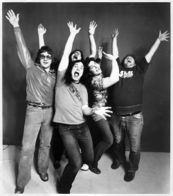

 

# __Rockanrolla Band Website - Testing__

After following all the sessions at Code Institute about UX and reading a lot of information in different platforms about UX Design and testing, I found some links and e-books rich on UX contents that helped me to decide the way to design and run tests on this project. Despite I am a newbie and design is a new whole world to me, I got engaged to one of these platforms and, since then, every time I have some spare minutes I try to enrich my knowledgement reading their books and articles. I relate some of the links I used for this below: 

[Studio by UXPin, Free UX Design Resources](https://www.uxpin.com/studio/)

[Guide to Usability testing](https://www.uxpin.com/studio/ebooks/guide-to-usability-testing/)

[22 Essential Tools for Testing Your Website's Usability](https://mashable.com/2011/09/30/website-usability-tools/?europe=true)

I have divided this document in two sections with different testing methods inside

+ __*Manual testing methods:*__ These are the testing methods I have used. First locally (simulating me as a visitor) on all the site pages and then requesting help from some colleagues to navigate externally through the site. Their help has been so valuable as explained on the briefings:
    - Local testing.
    - External testing.

+ __*Online testing methods:*__ These are the test methods I have used with different available tools online: 
    - Code Validation. 
    - Readability.

 *Back to top of the document*
  
## __Manual testing methods:__
---
### __*Local testing:*__

To run this tests I have used three different browsers(Chrome v73, Mozilla v66, Opera v58) under Windows 7 in a laptop. The features were tested first using developers tools to check the behaviour under Responsive Design and going through all Media Queries breakpoints defined. Then, I have run the site under a normal browser as a in full size and also resizing its window. This testing section talks about the elements along the site and the way they habe been checked.  

+ __*Header*:__

    Checked responsiveness rotating the screen to change the size of it and its elements responded properly. From small devices to bigger screens the element displayed totally diferent and the changes were displayed properly, changing their positions and sizes as expected. Title, as explained below, have been the most challenging issue as explained below.
    
    - __*Title*:__
        - Font size of the title has been one of the main issue when adjusting the responsive design to different screen. When checking with developers tools everything seemed to be working alright and the font was adjusting properly. But when working with browsers full size, when resizing them the font size was displayed in the same size always. Finding the issue and resolving this typography problem has been a challenge. It has made me think about the importance of this part of the design.

    - __*Band Logo*:__
        - Clicked over it on all pages and linked correctly to Home page (index.html) every time. When checking Media Queries on small devices this worked in the same way as expected.

    - __*Navigation menu*:__
        - Checked the 'burguer menu' on small devices in every page and bars color changed as expected when button was clicked. Then checked that menu toggled from hidden position on the left to the right, making visible the navigation items and links as expected. About the transitions, when checking on small devices, they couldn't apply because hover doesn't make any changes. Only when clicking on them the change expected could be noticed. About the links, I clicked on everyone of them and no one was broken, allowing me to navigate between pages as expected.

        - Checked the navigation menu on bigger devices, hovering over all navigation items to check that the background color and the text color changed. Also checked the transition time applied correctly. This worked fine and as expected. Also I checked again that all links were working properly as expected.

        - Checked responsiveness rotating the screen to change the size of it. All the navigation items elements moved from being displayed in column in small devices, to being displayed in line in bigger screens as expected. No overflow was noticed.
    
+ __*Section*:__
    
    Checked responsiveness rotating the screen to change the size of it and the two columns with their contents moved from being displayed in column in small devices, to being displayed side by side in bigger screens as expected. Their contents occupied the space available as expected. One thing to note about the column on the right is that there is still space available to display more information about the band in some of the pages. This should be a chance of future improvement for the site.

    - __*Titles*:__
        - Checked the sizes of the column titles. These ones were working wrongly and interfiering with the Responsive design until I learnt how to adjust progresevely the font-size for different screen sizes. Looking into different types of measure values to select the best one to apply to typograpy has been enrichment. This issue was solved applying progressively different font-sizes to different screen sizes. 
        
    - __*Carrousels*:__
        - Checked the behaviour of the carrousels in different screen sizes and no error or overflow was detected. Images and transitions were applied correctly. Contents adjusted thier size with responsiveness when rotating the screen.
        - Checked their functionality on every page displayed and the cards slided as expected displaying the contains without any overflow. Also the carrousels size were responsive when the screen size changed. To check this rotation win dev tools were used constantly to review the behaviour and looked that every carrousel was responding properly.    
    
    - __*Articles*:__
        - Checked the text colors to allow the content to be read and not mixed with the background colors and everything looked fine. Links inside them where showing the desired effect of changing color to yellow when hovering to highlight them. Text also stretched/expanded when reduced/increased the screen size.
        - As happened with the main web title, the adjusting of the size of the titles in these articles, the column titles, has been a challenge. Displayed properly using developing tools but not working when displayed on full size brosers after resizing/minimizing them. To adjust this optimized 

    - __*Forms*:__
        - Checked that validation request for two of the inputs (name and email) when any of these boxes was empty worked correctly. When this was the case and clicking on the 'submit' button, a warning message was displayed.
        - Responsiveness when changing screen sizes was checked looking at the widht of the input boxes when resizing.
        - On the comments box, a textarea was used instead of na input box to control the total number of characters available for the feedback. Checked the wrapping effect of the text when the line was full, no matter the screen size selected, and it worked fine.

    - __*Videoclips*:__
        - Responsiveness when changing screen sizes was checked looking at the width of the video boxes links and video frames when resizing and all of them where contained properly inside the parent column, adjusting their sizes with it.
        - Checked the menu of the videoclips looking into the effects expected when hovering on them, and the transitions about ths change on the scale worked correctly. Initially a change in the color of the background and the font when hovering was a thought but it did not looked fine with that type of font. An effect like the one in the navigation menu was looked for but it didn't work in terms of design so it was deprecated.
        - Checked that the links targeted the right frame when clicked. Also that the video autoplayed on this action and that, if other video is selected, no sounds and images are mixed. This looked to be working properly.

+ __*Footer*:__

    Checked responsiveness rotating the screen to change the size of it and the three elements changed as expected. In small devices developer's link is hidden and displayed a title encouraging the visitor to contact the band via social media. The width and height of the footer is adjusted properly and ocuppying the space available.
    
    - __*Fan Mail box*:__
        - Responsiveness when changing screen sizes was checked looking at the font sizes and the positioning of the titles. These titles adjusted fine when other elements were hidden or displayed. No other effect than the simple displaying of the fan mail box was included. 
      
    - __*Developer's link*:__
        - Responsiveness when changing screen sizes was checked looking at the way it was hidden or displayed. It occupied the right place with bigger screens and disappeared with small screens. Also checked that link wasn't broken.
        - Rotating 360 degrees effect when hovering over it, looking at the transition time mainly to not made the visitor dizzy, seemed to work fine.

    - __*Social media links*:__
        - Responsiveness when changing screen sizes was checked looking at the way a message was displayed with small screens and adjusting the size and positions between them .
        - As no effects were included when hovering over them, I checked that links weren't broken and they worked correctly.
      
 *Back to Manual testing methods*

 *Back to top of the document*

### __*External testing:*__

To run this tests I sent the GitHub Pages link to different friends and colleagues during the site developmnet process and, after a while, I received feedback from them about some improvements that could be made. Below are related some of them and the actions taken to improve the site.

+ __*Visitor 'A' Feedback*:__

    *"When navigating on my Samsung mobile I click the burguer menu button and the menu appears properly. When I select a page to go, I can't see if the changes applies because my thumb finger is over the screen and the section contentsare right below it..."*

    I took this feedback seriously and applied some changes on the section's elements margins and paddings to reduce the space with the header. 
    
    After this change, the visitor was contacted to check the changes and now he could notice that he was on another page when navigating between that menu items.
    
+ __*Visitor 'B' Feedback*:__

    *"When I am in the videoclips page, I can click on every video name and the the video starts displaying in the box below. If I click in other video it plays in its box below, but prevous one is still playing and sounds are mixed between them..."*

    Initially every videoclip was targetting different iframes. After this feedback, HTML was changed to create a videoclip list with only one iframe to target by all of them. This solved the issue so everytime a videolink was selected, the iframe was refreshed, avoiding  sound and image mixing.

    After this change, the visitor was contacted to check if the changes applied satisfied her expectations and she responded positively about it.

+ __*Visitor 'C' Feedback*:__

    *"The carrousels don't work! I have no arrows on the sides and when I click on the numbers to select one of them, it is not accurate. It doesn't take me to the one I selected."*

    This made a big impact in the project. I decided since the beginning of it and as a challenge to avoid the use of Bootstrap libraries and jQuery, but then the functionallity of them carrousels wasn't good enough. Commenting the posibilities of a big change in the way I was coding with the online community and other developers, following suggestions about how to do it, made me take the decision to include and edit Bootstrap and jQuery in the project. This change made the carrousels display it contents properly and improve the UX when using them. 
    
    After this change, the visitor was contacted to check if the changes applied to the carrousels were noticed and if the contents selected were displayed properly and he answered that "it was like night and day". Open mind feedback and another pair of eyes is always worth in every aspect of life. I was reluctant about a big change in the project but this made change my mind and, after solving this issue, motivation about coding was again increased .

 *Back to Manual testing methods*

 *Back to top of the document*

## __Online testing methods:__
---
To run this tests I have used three different applications online. Limited by the budget of the project (0), only free tools have been used but the research of many different ones have opened a wide view about how a project could be tested in many ways. 
 

### __*Code Validation:*__ 

Testing HTML / CSS code in the project regularly has been of great help. The tools used are related below as also the .pdf files directory with the results of those tests, including warnings of different types and pass reports. 

+ [The W3C Markup Validation Service](https://validator.w3.org/)

+ [The W3C CSS Validation Service](https://jigsaw.w3.org/css-validator/validator.html.en)

+ [Code Validation Test Results](assets/project_docs/Tests/Code validation/)

### __*Readability:*__ 

+ [Readability test tool](https://www.webfx.com/tools/read-able/check.php?tab=Test+By+Url&uri=https%3A%2F%2Fdanmtt.github.io%2Frockanrolla%2F)

+ [Readability test results](assets/project_docs/Tests/Readability/)

 *Back to Online testing methods*

 *Back to top of the document*

